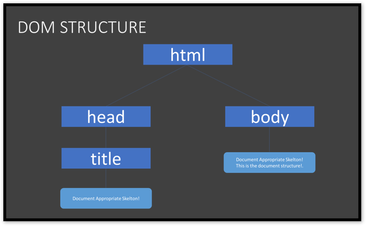

# HTML - CSS - JS

|			 				|																																						|
| ----------- | ------------------------------------------------------------------------- |
| HTML 				| A markup language used to outline a webpage, and a procedure for making. 	|
| CSS  			 	| A procedure for making our sites more visually appealing.                	|
| JavaScript 	|	A programming language used to make websites faster and more interactive	|

| TABLE OF CONTENTS   														 |
| ------------------------------------------------ |
| [ HTML document structure ](#)                   |
| [ Adding _`CSS`_ on HTML document structure ](#) |

A typical HTML document will have the following structure:

	1. Document declaration
	2. Document root tag
	3. Document head and it's related tags
	4. Document body and it's related tags

_We will be study the *&lt;head&gt;* and *&lt;body&gt;* related tags in subsequent section. but before we go any futher, let's just look at what is `document declaration`._

The `DOCTYPE` declaration tag is used by the web browser to understand the version of the HTML used in the document. There are many other declaration types which can be used in HTML document depending on what version of HTML is being used. Current version of HTML is _`HTML5`_ and it makes use of the following declaration: *&lt;!DOCTYPE html&gt;*.

```` html
<!--/ @tshikororoda
  Folder: hds/hds.index.html
  It's specified before the HTML root tag

-->

<!DOCTYPE html> <!-- HTML5 document version declaration -->

````


| Tags 		       | Description                                             |
| -------------- | ------------------------------------------------------- |
|`<!DOCTYPE...>` | _This tag defines the document type and HTML version._  |

```` html
<!--/@tshikororoda
 Folder: hds/hds.index.html
 Document root tag

-->

<!DOCTYPE html> <!-- HTML5 document version declaration -->
<html dir="ltr" lang="en">

</html>

````

| Tags 		       | Description |
| -------------- | ----------- |
| _`<html>`_     | _This tag encloses the complete HTML document and mainly comprises of document header which is represented by `<head>...</head>` and document body which is represented by `<body>...</body>`tags._ |

_`dir`_ and _`lang`_ are attributes of `HTML elements`. Attributes provide additional information about elements. Always specified attributes at the start tag: _&lt;element lang="language_code"&gt;_. The _`dir`_ attribute specifies the text direction of the element's content. The _`lang`_ attribute specifies the language of the element's content.

Document _&lt;head&gt;_ element and its related tags

```` html
<!--/@tshikororoda
 Folder: hds/hds.index.html
 Document head and its related tags

-->

<!DOCTYPE html> <!-- HTML5 document version declaration -->
<html dir="ltr" lang="en">
  <head>

<!--____________________________________________
  [ Document header related tags here ]
-->

    <meta charset     ="utf-8" />
    <meta http-equiv  ="X-UA-Compatible"  content="IE=edge" />
    <meta name        ="viewport"         content="width=device-width; initial-scale=1.0" />

    <title> Document Appropriate Skeleton&#33; </title>

  </head>

</html>

````

| Tags 		   | Description |
| -----------| ----------- |
| `<head>`   | _This tag represents the document's header which can keep other HTML tags like `<title>, <meta>` etc._ |
| `<title>`  | _The `<title>` tag is used inside the `<head>` tag to mention the document title._                     |

Document _&lt;body&gt;_ element and its related tags

```` html
<!--/@tshikororoda
 Folder: hds/hds.index.html
 Document head and its related tags

-->

<!DOCTYPE html> <!-- HTML5 document version declaration -->
<html dir="ltr" lang="en">
  <head>

<!--____________________________________________
  [ Document header related tags here ]
-->

    <meta charset     ="utf-8" />
    <meta http-equiv  ="X-UA-Compatible"  content="IE=edge" />
    <meta name        ="viewport"         content="width=device-width; initial-scale=1.0" />

    <title> Document Appropriate Skeleton&#33; </title>

  </head>
  <body>

<!--____________________________________________
  [ Document body related tags here ]
-->

    <h1> &#39;Document Appropriate Skelton&#33;&#39; </h1>
    <p> This is the document structure&#33;. </p>

  </body>
</html>

````
| Tags 		  | Description |
| --------- | --------------------------------------------------------------------------------------------------- |
| `<body>`  | _This tag represents the document's body which keeps other HTML tags like `<h1>, <div>, <p>` etc._  |
| `<h1>`    | _This tag represents the heading._                                                                  |
| `<p>`     | _This tag represents a paragraph._                                                                  |

#### Summery
In the first line, we are declaring _(to the web browser)_ that we are writing the document in the latest version of `HTML: HTML5`.
After that, the page consists of `nested HTML elements` _(such as html, head and body)_, each with an opening and closing tag. _Notice how each of the inner elements is indented just a bit further than the last. While this is not necessarily required by the browser, it will be very helpful to keep this up in your own source code_. HTML elements can include _`attributes`_, which give the browser `extra information about the element`. For instance: when we include `lang="en"` in our root tag, we are informing the web browser that we are using English as our primary language. when we include `dir="ltr"` we are informing the web browser to `display text from left to right direction`.
Inside the HTML element, we include both a head and a body tag. The head element will include information about your page that is not necessarily displayed, and the body element will contain what is actually visible to users who visit the site.
Within the head, we have included a title for our webpage, which you’ll notice is displayed in the tab at the top of our web browser.
_Finally_, we’ve included the text ``“&#39;Document Appropriate Skelton!&#39;” and “This is the document structure!”`` in the body, which is the visible part of our page.

:clock1: *`Last modified: 2022-06-16, time: 16:05PM`*
***

#### ADDING CSS ON HTML DOCUMENT STRUCTURE
+ [ How to associate style sheet to an HTML document? ](#)
+ [ CSS overriding. ](#)
+ [ CSS Syntax is made of three parts. ](#)
+ [ How to applied style rule to an element? ](#)
  + [ Type selector. ](#)
  + [ Universal selector. ](#)
  + [ Descendant selector. ](#)
  + [ Id selector. ](#)
  + [ Class selector. ](#)
  + [ Child selector. ](#)
  + [ Attribute selector. ](#)
+ [ Responsive design ](#)
+ [ Sass ](#)

##### How to associate style sheet to an HTML document?
+ _`Inline css`_ - We apply css syntax using style attribute on an element.
+ _`Embedded css`_ - We apply css syntax using _&lt;style&gt;_ element. This tag is _&lt;Head&gt;_ related tag.
+ _`External css`_ - We apply css syntax on a separate text file with _.css `extension`_.
  - We include on HTML document file using _&lt;link&gt;_ tag. or
  - We include on HTML document file using _`@Import url("");`_

##### CSS overriding
+ _`Inline style`_ sheet takes highest priority since it override _`Embedded`_ and _`External`_ style sheet.
+ _`Embedded style`_ sheet override _`External style`_ sheet.
+ _`External style`_ sheet takes low priority.

##### CSS Syntax is made of three parts
+ `Selector` - An element at which css rule will be applied.
+ `Property` - An element attribute _(All HTML attribute are converted into CSS properties)_.
+ `Value`    - Value assigned to the property.

##### How to applied style rule to an element?

###### Type selector
```` CSS
/* Select and applied style rule at all level 2 heading */
h2 { }

/* Grouping selector */
h1, h2, h3, h4, h5, h6 { }

````

###### Universal selector
````CSS
/* Select and applied style rule at all element */
* { }

````

###### Descendant selector
````CSS
/* Select and applied style rule to <a> element only when it lies within div ul li */
div ul li a { }

````

###### Id selector
````CSS
/* Select and applied style rule to the element with id attribute set to tda-main-header */
#tda-main-header { }

/* Select and applied style rule to the <h2> element with id attribute set to tda-main-header */
h2#tda-main-header { }

/*
  Select and applied style rule to the <h2> element when <h2>lies within an element
  with id attribute set to tda-main-header  */
#tda-main-header h2 { }

````

###### Class selector
````CSS
/* Select and applied style rule to the element with class attribute set to clear */
.clear { }

/* Select and applied style rule to the <h1> element with class attribute set to clear class */
h1.clear { }

/* Select and applied style rule to the <h2> element when <h2> element lies within an element
with class attribute set to a clear class  */
.clear h2 { }

````

###### Child selector
````CSS
/* Select and applied style rule to <div> element if <div> is direct child of <body> element. */
body > div { }

````

#### Attribute selector
````CSS
/* Select and applied style rule to <input> element with attribute type set to text */
input[type="text"] { }

````

:clock1: *`Last modified: 2022-06-16, time: 19:55PM`*
***

##### ADDING JAVASCRIPT ON HTML DOCUMENT STRUCTURE

+ [ How to place JavaScript in an HTML document? ](#)
+ [ How to access element in the DOM? ](#)
+ [ How to *run* JavaScript _`functions`_ when the HTML document is loaded? ](#)


###### How to `place` JavaScript in an HTML document?
+ [ JavaScript placed in the <head> element section: _&lt;head&gt;_ ](#)
+ [ JavaScript placed in the <body> element section: _&lt;body&gt;_ ](#)
+ [ External JavaScript source file ](#)

``` html
<!--

  JavaScript placed in the <head> element section.

-->
<head>
	<script>

		alert("JavaScript placed in the <head> element");

	</script>
</head>

```

``` html
<!--

    JavaScript placed in the <body> element section.

-->
<body>
	<script>

		document.write("JavaScript placed in the <body> element");

	</script>
<body>

```

```html
<!--

  External JavaScript source file

-->
<script src="./js/main.js"></script>

```

###### How to access element in the DOM?
`DOM - Document Object Model` The DOM is a convenient way of visualizing the way HTML elements relate to each other using a tree-like structure. Below is an example of the DOM layout from our HTML document structure:



| Get by 	            | Selector syntax   | Method	                  |
| ------------------- | ----------------- | ------------------------- |
| **ID**			        | _#tda-copyright_	| _getElementById()_        |
| **Class**			      | _.tda-copyright_	| _getElementByClassName()_ |
| **Tag/element**	    |	_p(any element)_	| _getElementByTagName()_   |
| **Single selector** | _id/class/tag_	  | _querySelector()_         |
| **All selector**	  | _id/class/tag_	  | _querySelectorAll()_      |

JavaScript code:
```` js
// assets/js/main.js

const byId         = document.getElementById('tda-copyright');
const byClass      = document.getElementByClassName('tda-copyright');
const queryById    = document.querySelector('#tda-copyright');
const queryByClass = document.querySelectorAll('.tda-copyright');
const byTag        = document.getElementByClassName('p');

// Adding CSS using JavaScript
byId.style.backgroundColor  = 'yellow';
byId.style.fontSize         = '26pt';
byId.style.color            = 'blue';

````

HTML code:
```` html
<!--/@tshikororoda
 Folder: hds/hds.index.html
 Document head and it's related tags

-->

<div id    ="tda-copyright"> Access this by ID     </div>
<div class ="tda-copyright"> Access this by class  </div>

<!-- Accessing by Tag/element -->
<p> By element </p>

````

###### How to *run* JavaScript _`functions`_ when the HTML document is loaded?

`Program:` `Program:` Our task is to write a program which get the current year and display the obtained results to _copyright_ statement of our website.

###### Pseudo code:
Create function called `thisYear()`. <br />
Declare local variable: `currentDate, year, thisYear and tdaCopyright`. <br />
Implimate the `object Date()` using keyword `new`. <br />
Get the current year. <br />
Create a text node. <br />
Get/select an element where output message shoud be append to. <br />
Append/insert the output results to the selected element. <br />
Print the text string appended only with slateblue color.

JavaScript code
``` js
"use strict";

// create a function
function thisYear(){

	// Declaring local variables
	let currentDate;
	let year;
	let tdaCopyright;
	let thisYear;

	// Create an object for Date()
	currentDate = new Date();

	// Get the current year
	year        = currentDate.getFullYear();

	// Create text node
	thisYear    = document.createTextNode(year);

	// Get/select the element to insert content into container
	tdaCopyright = document.querySelector('#tda-copyright');

	//  Insert current year into an element selected
	tdaCopyright.parentNode.insertBefore(thisYear, tdaCopyright);

	/* CSS

		print text in slateblue color only.

	*/
	tdaCopyright.parentNode.style.color = 'slateblue';

}

// Run this functions when the document is loaded
window.onload = function()	{

// #01

	thisYear();

}

/*
The code below does the same thing #01 does.

// Run this functions when the document is loaded
window.onload(

	thisYear()
);

or

window.onLoad = thisYear;

*/

```

HTML code
``` html
<span id="tda-copyright">&#169;</span>

```

:clock1: *`Last modified: 2022-06-23, time: 14:01PM`*
*****
